# TOPIC 01 - FUNDAMENTAL OF C PROGRAMMING LANGUAGE

## 1. Introduction

**C** is a general-purpose programming language created by **Dennis Ritchie** at  the Bell Laboratories in **1972**[^1].

It is a very popular language, despite being old. The main reason for its popularity is because it is a fundamental language in the field of computer science.

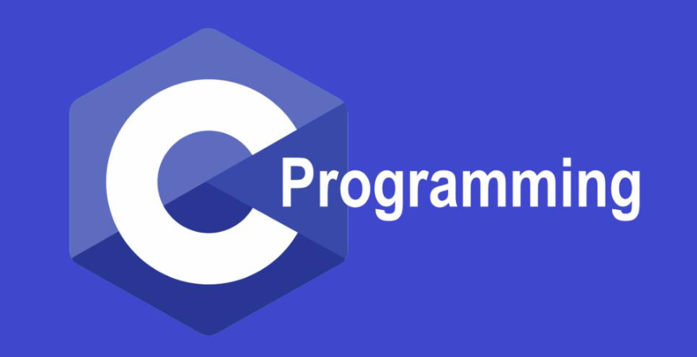

C is strongly associated with UNIX, as it was developed to write the UNIX operating system.

## 2. Development Environment

In this section, we presenta a development enviroment for working with your C program. A development enviroment is a collection of procedures and tools for developing, testing and debugging an application or program.

In this course, we mainly focus on Cygwin[^2], a framework contains the number of tools which provide functionality similar to Linux distribution on Windows OS. To install Cygwin on your computer, first, you need download the setup file, which is available on the Cygwin homepage.

> Note: **You have to choose the right version of your system, either 32-bit or 64-bit.**

### 2.1 Install Cygwin and GCC

After completely download the appropriate setup file, let's begin the installation process.

From **Figure 1** to **Figure 10** show the step-by-step guild to successfully install Cygwin and GCC enviroment on your system.

**Figure 1**: Welcome screen of Cygwin installation

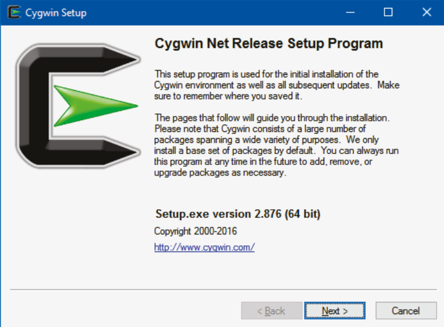

**Figure 2**: Choose the way to download the installation source

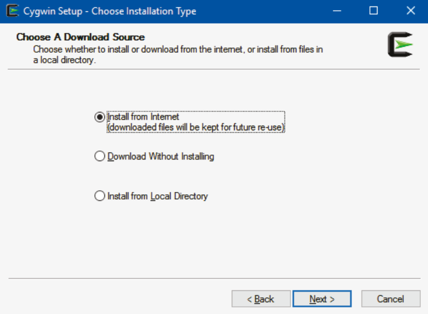

**Figure 3**: Select root install directory

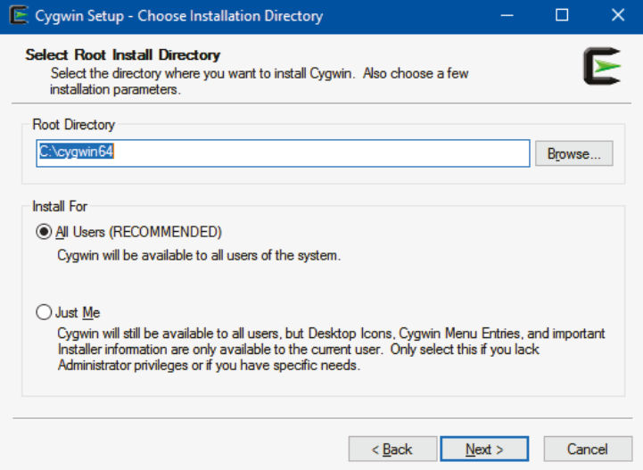

**Figure 4**: Select the directory of local package

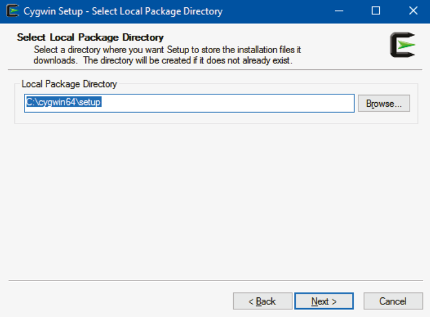

**Figure 5**: Select your internet connection

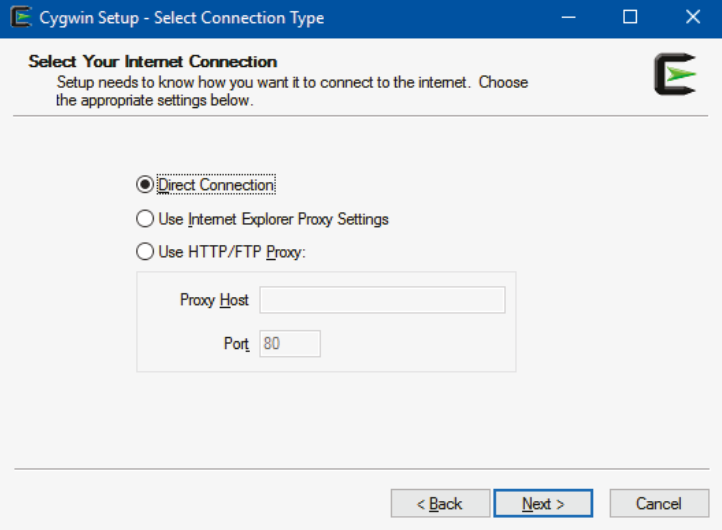

**Figure 6**: Select a download site

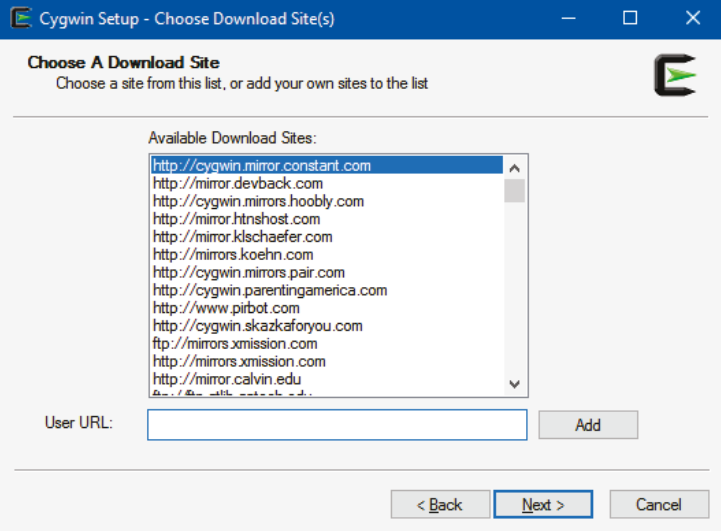

**Figure 7**: Select package
> Note: This is the most important step, you must select the following components to work with C/C++ environment on Cygwin, by clicking "*Skip*" marker:

- **gcc-core**: C compiler sub-package.
- **gcc-g++**: C++ sub-package.
- **labgcc1**: C runtime library.
- **gdb**: The GNU Debugger.
- **make**: The GNU version of the 'make' utility.
- **libmpfr4**: A library for multiple-precision floating-point arithmetic with exact rounding.

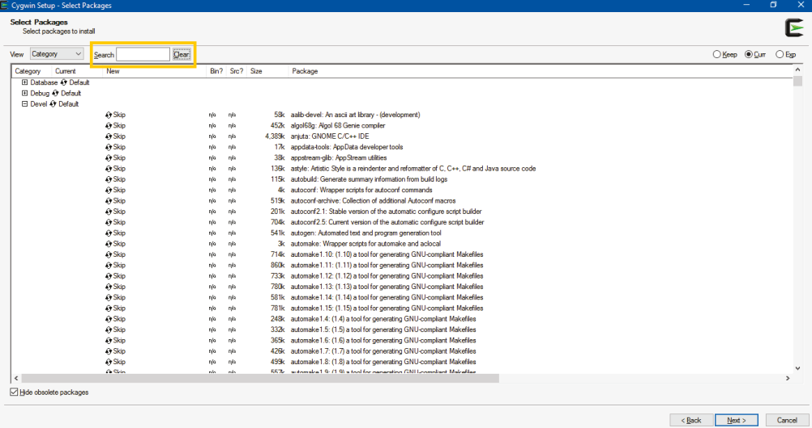

**Figure 8**: Resolving dependencies for setup process

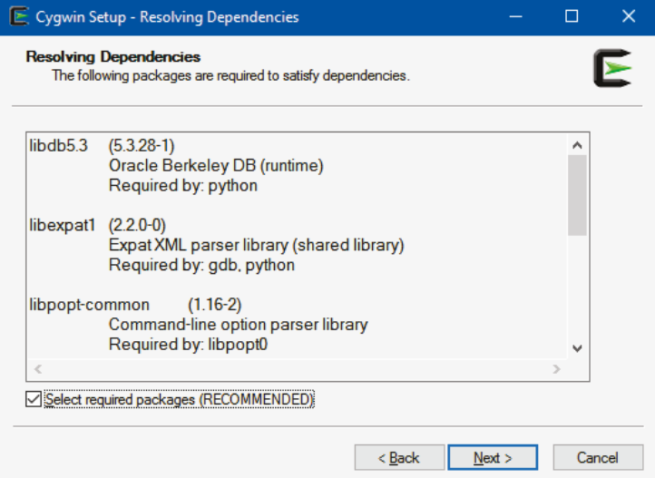

**Figure 9**: Installing Cygwin and components

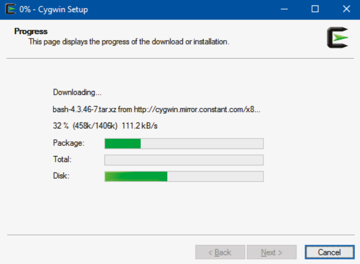

**Figure 10**: Installation complete screen

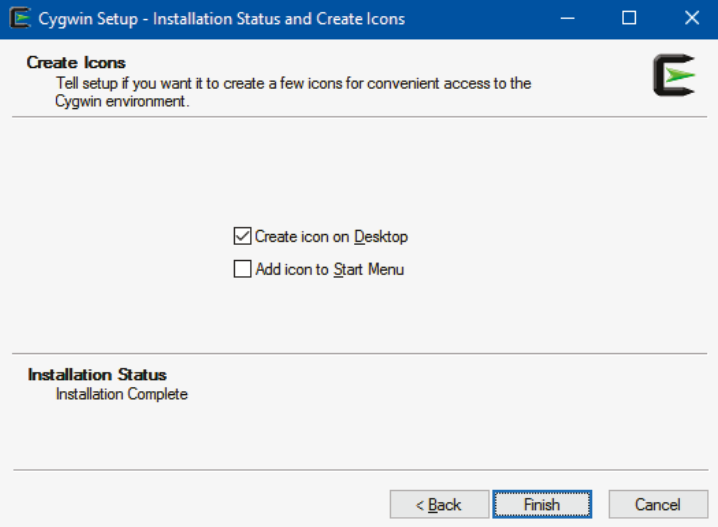

### 2.2 Add Cygwin to System Path

After we have successfully all requirement components to work with C/C++ on Cygwin environment, but you can only call Cygwin commands in Cygwin Terminal. The question is, can call Cygwin commands in within either Windows CMD command-line or Windows PowerShell. Absoblutely, the answer is "Yes", we need few more steps to do this. First, you need to navigate to System Properties windows by following step-by-step:

With Windows 11:

- Right-click on "This PC" tab on File Explorer, after that we select "Properties".
- The Settings tab will be opened, we select "Advanced System Settings" which below Device Specifications section.
- We select "Environment Variables...". In System Variables section, we select "Path" -> select "New" -> type the path of Cygwin "bin" directory. (bin directory locate within root directory in **Figure 3**)

With Window 10: We can search "edit the system environment variables" and do step 3 similar to Windows 11.

## 3. C Programming Language

Before we go deeper into C programming language, let's execute your first C program. We should create folder for learning C programming language, we create folder **Topic_01** and sub folder **codes** into **Topic_01** to store source code for this learning.

In **codes** folder, we create a new file with name file is first_program.c. In this file, you will paste below code into this file:

```C
// first_program.c
// A first program in C
#include<stdio.h>

// function main begins program execution
int main(){
    printf("Hello World!\n");
}
```

Although this program is simple, it contains several importaint features of the C/C++ programming language. Lines **1**, **2**, and **5** begin with // symbol, indicates that these lines are comments. You should insert comments to your program for program readbility, and comments are ignored by the compiler. Another wat to make comments to your program is using `/* ... */`, a multi-line comments.

Line **3** is a pre-processor directive, in this case, we tell the preprocessor to include the contents of the **standard input/output header** in the current program. Line **6**, the main function, is a part of every C/C++ program. The parentheses after main indicate that main is a program building block called a function. C/C++ programs contain one or more functions, on of which must be main. Every program in C/C++ begins executing at the function main. The keyword **int** before the **main** function indicates that this function returns an integer value.

In line **8**, we call a statement, printf, to instruct the computer performs an action, in this case, display the string of characters marked by the quotation marks on the screen. An important note is that every statement must end with a semicolon (;), as knowledge as the statement terminator. The last two characters in the argument of printf statement is called escape character. these characters will not be printed on the screen, below table shows some common escape characters.

| Escape sequence | Description                                                     |
| :--:            | :--                                                             |
| `\n`            | Newline. Position the cursor at the beginning of the next line. |
| `\t`            | Horizontal tab. Move the cursor to the next tab stop.           |
| `\a`            | Alert. Produces a sound or visible alert without changing the current cursor position |
| `\\`            | Backslash. Insert a backslash character in a string.            |
| `\"`            | Double quote. Insert a double-quote character in a string.      |

You had an overview of a program in C. Now, we focus on how to compile your document program to an executable program.

----
[^1]: Wikipedia, "C (programming language)", 17 May 2024. [Online]. Available: [Here](https://en.wikipedia.org/wiki/C_(programming_language)) [Accessed 21 May 2021]
[^2]: [Cygwin](https://www.cygwin.com/)
