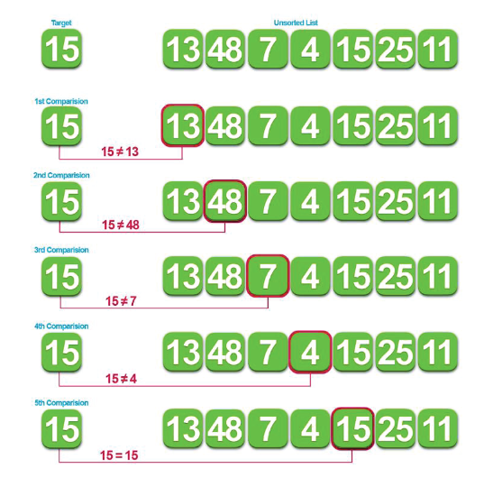
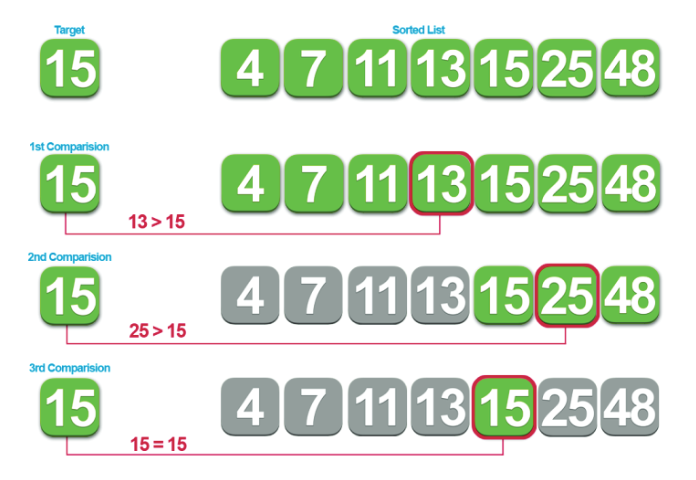
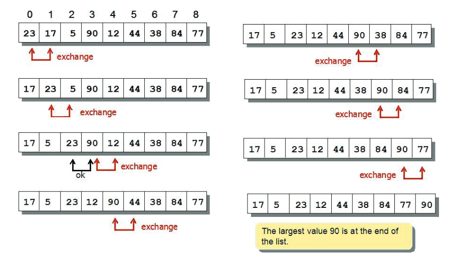

# **TOPIC 07 - SEARCHING AND SORTING**

## **1. Introduction**

After completing this lab, you will understand the basic searching and sorting algorithms. Besides that, we introduce the concept of complexity analysis.

## **2. Searching**

Searching iss a common task which can appear in any application/software. The problem of searching can state as follow: given a list (collection of data) and a search key `x`, return the position of `x` in the list if it exists. There are two popular strategies to search an object in given list, which are (1) *sequential search (linear search)* and (2) *binary search*.

### **2.1 Sequential search**

The basic idea of this strategy is searching a key `x` in linear progression, from the given started point until desired element is found or the list is exhausted. Linear searches are used if the list that is to be searched is not ordered. Generally, this technique is used for small lists, or lists that are not searched often. This below figure illustrates how sequential search works.



In a linear search, we start searching for the target from the beginning of the list. We continue until we either find the target or reach the end of the list and learn that the target is not in the list. We can easily see that, in the best-case scenario, the search key `x` is in the first index and we only need one conparision. In the worst-case scenario, the search key `x` is in the last index or not found in the list, thus we need to traverse the whole list.

The following program implements the sequential search algorithm when the list is an array.

```C
int search(const int* arr, const int size, const int key){
    for(int i = 0; i < size; i++){
        if(arr[i] == key) return i;
    }
    return -1; // in case not found
}
```

### **2.2 Binary search**

Binary search starts by comparing the target (the value that you are looking for) with the value found in the middle index of the list. If the value found in the middle index is greater than that of the target, you can ignore all the data that is after that middle index.



In **above figure**, by doing the first comparison (15 > 13), we then know that our target can be only in the right-hand side. If the target is in the second half, there is no need to further check the first half. That means, we eliminate half of the list from further searching. The process is then repeated with the remaining data until we either find the target value or satisfy ourselves that the target is not in the list. However, binary search algorithm can only work when the list is in order (*e.g.*, ascendant, descendant).

The following program implements the binary search algorithm when the list is an array.

```C
int bsearch(const int* arr, const int size, const int key){
    int low = 0, high = size - 1;
    while(low <= high){
        int mid = (low + high) / 2;
        if(key == arr[mid]) return mid;
        else if(key > arr[mid]) low = mid + 1;
        else high = mid - 1;
    }
    return -1; // in case not found
}
```

### **2.3 Worst-case analysis**

At this point, we introduced two approaches of searching a key in given list, let's analysis the worst-case of each algorithm. We use Big-Oh notation to give a rough estimate of the complexity. This is usually sufficient. We remove the additive and multiplicative factors from the expression, and say that the complexity of the algorithm is "*on the order of*" some expression containing *n*.

| **Array size *n*** | **Sequential search (*n* comparisons)** | **Binary search** |
| :--:               | :--:                                    | :--:              |
| 100                | 100                                     | $\approx 7$       |
| 1.000              | 1.000                                   | $\approx 10$      |
| 10.000             | 10.000                                  | $\approx 14$      |
| 100.000            | 100.000                                 | $\approx 17$      |
| $10^{9}$           | $10^{9}$                                | $\approx 30$      |

From the above table, we can conclude that binary search algorithm uses less resource than sequential algorithm. Obviously, at each iteration, binary search algorithm splits the original list into two parts, and repeats it until the target found or the list is empty. And the complexity of two algorithms are as follows:

- Sequential search: *O(n)*.
- Binary search: *O*($\log_{2}n$)

### **2.4 Key to remember**

|           | **Sequential search** | **Binary search** |
|  --:      | :--                   | :--               |
| **Speed** | *O(n)*                | *O*($\log_{2}n$)  |
| **Order** | The list is sorted or not. | The list must be sorted. |
| **Best-case scenario** | The item is found in the first comparison. | The item will be found faster than a Sequential Search. |
| **Worst-case scenario** | The item is found in the last index of the list of it is not located in the list at all. | The item will be found just as fast as a Sequential Search. |

## **3. Sorting**

Sorting is any process of arranging items in some sequence and/or in different sets. Sorting is important because once a set of items is sorted, many problems (such as searching) become easy.

- Searching can be speeded up. (From linear search to binary search).
- Determining whether the items in a set are all unique.
- Finding the median item in a list.

Given a list of *n* items, arrange the items into ascending order. There are many algorithms for sorting a given list, however, in this course, we'll focus on two basic algorithms: selection sort and bubble sort.

### **3.1 Selection sort**

The selection sort algorithm contains three main steps:

- Find the smallest element in the list (`find_min`).
- Swap this smallest element with the element in the first position. Now, the smallest element is in the right place.
- Repeat steps 1 and 2 with the list having one fewer element (*i.e.*, the smallest element just found and its place is "discarded" from further processing).

The **below figure** is a pictorial depiction of the entire sorting process.


The following program implements the selection sort algorithm when the list is an array.

```C
void selection_sort(int *arr, int size){
    int i, start, min_index, temp;
    for(start = 0; start < size - 1; start++){
        // find the index of minimum element
        min_index = start;
        for(i = start + 1; i < size; i++){
            if(arr[i] < arr[min_index]) min_index = i;
        }

        // swap minimum element with element at start index
        temp = arr[start];
        arr[start] = arr[min_index];
        arr[min_index] = temp;
    }
}
```

We choose the number of comparisons as our basis of analysis. Comparisons of array elements occur in the inner loop, where the minimum element is determined. Assuming an array with *n* elements, the running time complexity of selection sort algorithm is $O(n^{2})$.

### **3.2 Bubble sort**

Selection sort makes one exchange at the end of each pass. Therefore, the key idea of bubble sort is to make pairwise comparisons and exchange the positions of the pair if they are in the wrong order. FIG is a pictorial depiction of the entire sorting process.



The following program implements the bubble sort algorithm when the list is an array.

```C
void bubble_sort(int *arr, int size){
    int i, limit, temp;
    for(limit = size - 2; limit >= 0; limit--){
        // limit is where the inner loop variable i should end
        for(i = 0; i <= limit; i++){
            if(arr[i] > arr[i + 1]){
                // swap arr[i] with arr[i + 1]
                temp = arr[i];
                arr[i] = arr[i + 1];
                arr[i + 1] = temp;
            }
        }
    }
}
```

Bubble sort, like selection sort, requires *n* - 1 passes for an array with *n* elements. The comparisons occur in the inner loop, and the total number of comparisons is calculated in the formula below:

$$\sum_{i=1}^{n-1}i = \frac{n(n - 1)}{2} \approx n^{2}$$

Therefore, the running time complexity of selection sort algorithmis $O(n^{2})$.

## **4. Exercise**

1. Implement the sequential search algorithm.
2. Implement the binary search algorithm.
3. Implement the selection sort algorithm for sorting a list is descendant order.
4. Implement the bubble sort algorithm for sorting a list is descendant order.
