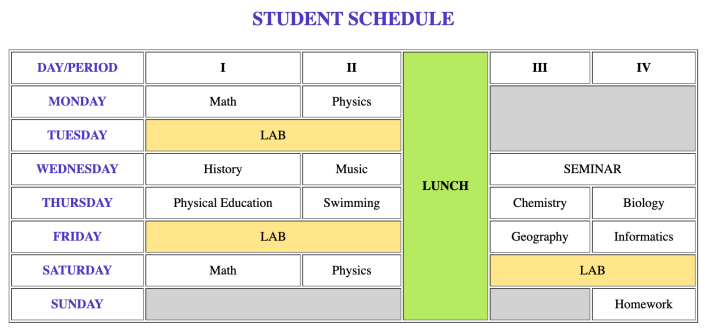
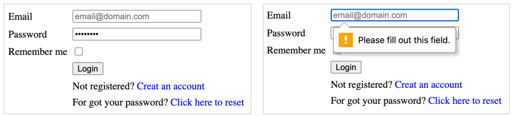
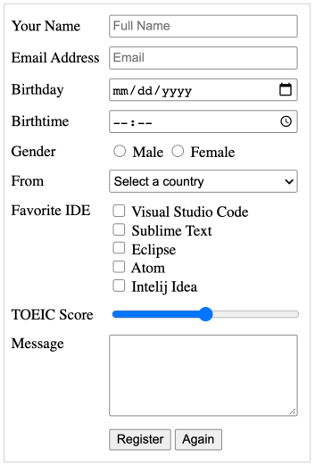
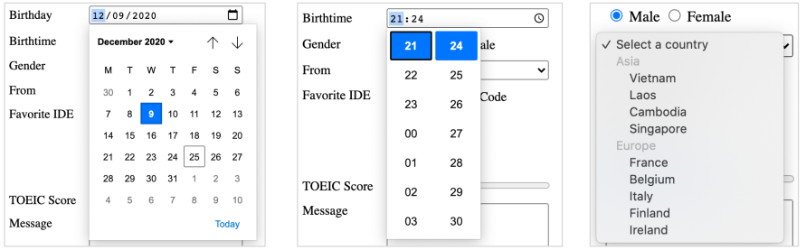
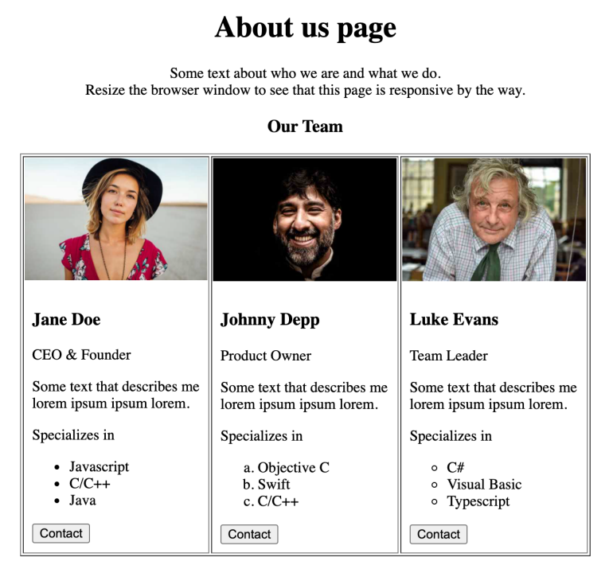

# **TOPIC 01 - HTML INTRODUCTION**

HTML is the standard markup language for creating Web pages.

## **1. What is HTML?**

- HTML stands for Hyper Text Markup Language
- HTML is the standard markup language for creating Web pages
- HTML describes the structure of a Web page
- HTML consists of a series of elements
- HTML elements tell the browser how to display the content
- HTML elements label pieces of content such as "this is a heading", "this is a paragraph", "this is a link", etc.

## **2. A Simple HTML Document**

```html
<!DOCTYPE html>
<html>
<head>
    <title>Page Title</title>
</head>
<body>

    <h1>My First Heading</h1>
    <p>My first paragraph.</p>

</body>
</html>
```

Example Explained

- The `<!DOCTYPE html>` declaration defines that this document is an HTML5 document
- The `<html>` element is the root element of an HTML page
- The `<head>` element contains meta information about the HTML page
- The `<title>` element specifies a title for the HTML page (which is shown in the browser's title bar or in the page's tab)
- The `<body>` element defines the document's body, and is a container for all the visible contents, such as headings, paragraphs, images, hyperlinks, tables, lists, etc.
- The `<h1>` element defines a large heading
- The `<p>` element defines a paragraph

## **3. What is an HTML Element?**

An HTML element is defined by a start tag, some content, and an end tag:

`<tagname> Content goes here... </tagname>`

The HTML **element** is everything from the start tag to the end tag:

```html
<h1>My First Heading</h1>
<p>My first paragraph.</p>
```

| Start tag   | Element content      | End tag |
| :--         | :--                  | :--     |
| `<h1>`      | My First Heading     | `</h1>` |
| `<p>`       | My first paragraph.  | `</p>`  |
| `<br>`      | *none*               | *none*  |

## **4. Web Browsers**

The purpose of a web browser (Chrome, Edge, Firefox, Safari) is to read HTML documents and display them correctly.

A browser does not display the HTML tags, but uses them to determine how to display the document:


## **5. Exercise**

Objective: The goal of this week's exercises is to create simple web pages using common html elements like tables, lists, forms, ...Inline-CSS code may also be covered in these exercises in order to improve the look and feel of the UI.

1. **HTML TABLE**

    \
    **Requirements:**
    1. All text contents are center aligned in every cell, both vertically and horizontally.
    2. The merged cells are filled with a background color.

2. **LOGIN FORM**

     \
    The form need to submit its information to `#` using
    HTTP `POST` method. The server expects to receive an `x-www-form-urlencoded` body containing two keys: **email** and **password**.

    **Requirements**:

    1. Form elements should be placed inside a hidden table element.
    2. Remove underlines from all hyperlinks (`<a>` elements).
    3. Password is the required field.
    4. If a valid email address is not entered, the form should not be submitted (HTML5 feature).

3. **REGISTER FORM**

    

    

    **Requirements**:
    1. All form control elements should be left aligned.
    2. For "Gender" field, only one option can be selected at a time.
    3. For "Favorite IDE" and "Message" fields, their labels should be placed on top of the section.
    4. If **Again** button is clicked, all input element values will be restored to their default value.

    The form must submit its information to `#` using
    HTML **POST** method. The server expects to receive an `x-www-form-urlencoded` body containing the following keys: name, email, birthday, birthtime, gender, country, favorite_ide, toeic, message.
    - For gender field: its value must be either '**male**' or '**female**'.
    - For toeic field: the maximum value is 990, minimum value is 5 and each step would increase or decrease the value by a factor of 5.

4. **ABOUT PAGE**

     \
    The images should be responsive: their size will be increased automatically when we increase browser size (and vice versa).s
